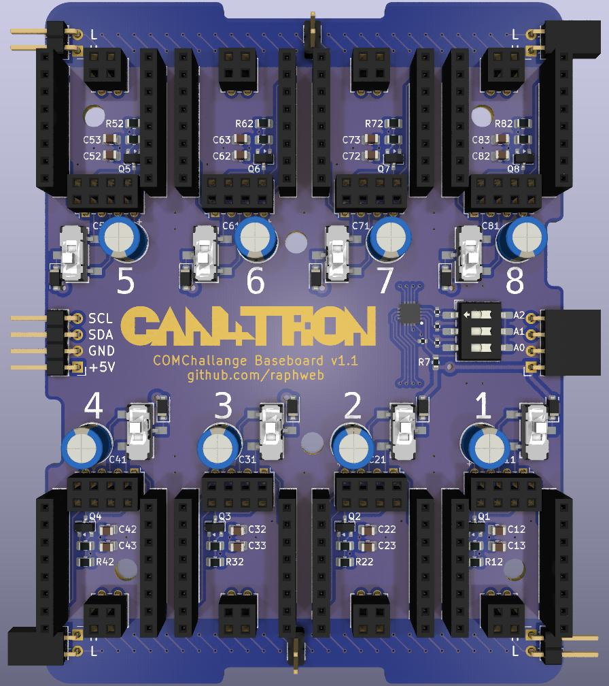
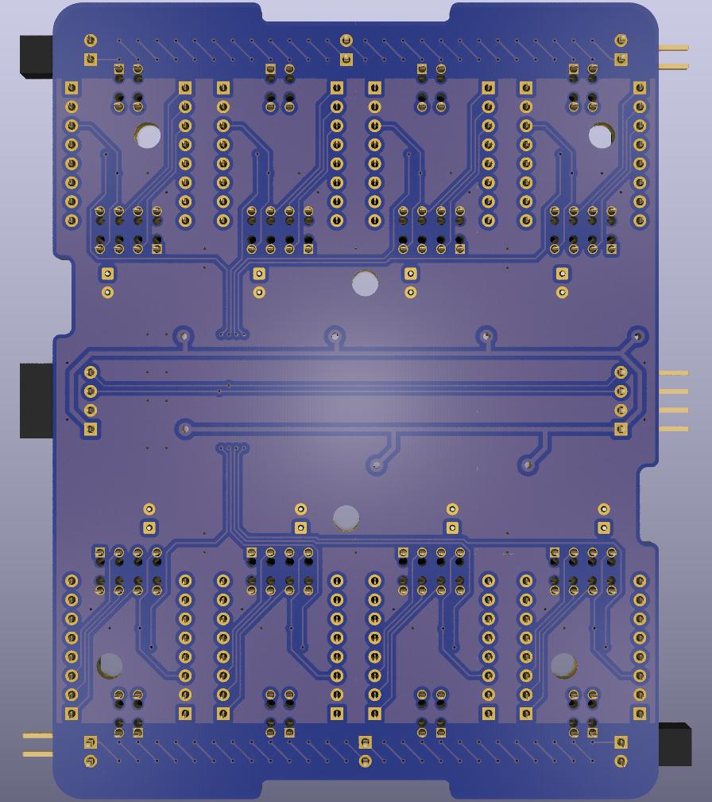

# COMChallenge
Hardware and software parts for the COM challenge.

## Hardware
There is a base board to put up to 8 ESP32-C3 Minis on, including different COM transceivers. Currently, a TJA1050 CAN transceiver is supported. As an extra feature, there is a I²C bus controlled port expander to switch on/off the power for each of the 8 ESP32 modules. A hardware switch can override the port expaneder setting and provide power regardless. The base board can actually run two different COM busses, 4 for the top and 4 for the bottom ESP32 modules.

### Base Board Front:

### Base Board Back:

More details in the [sardware folder](/hardware/).

## Software
There are examples in the [software folder](/software/).
